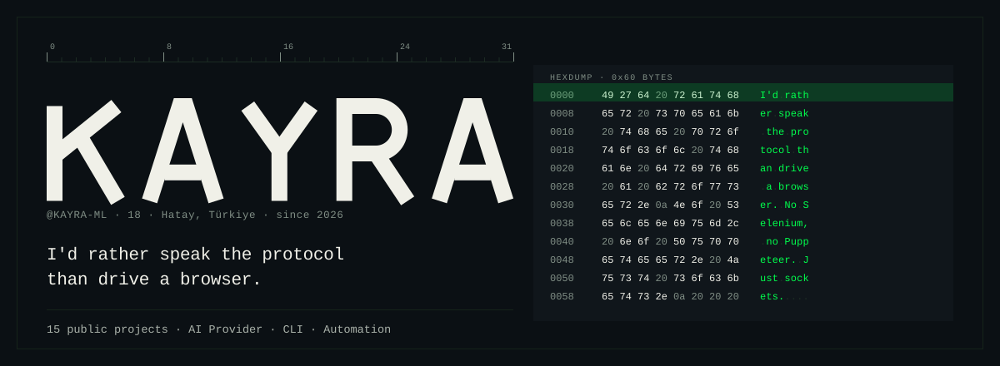
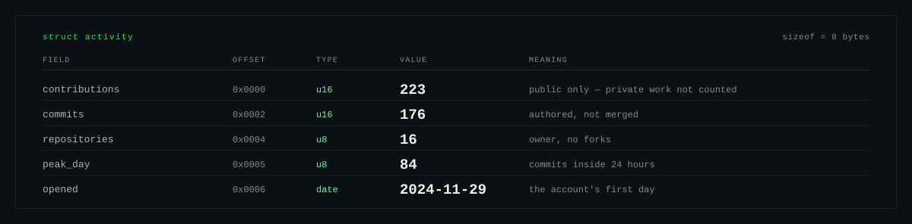
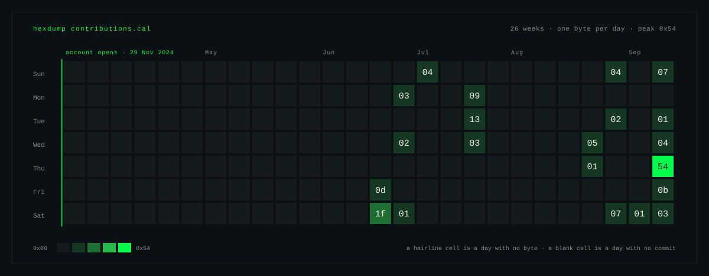
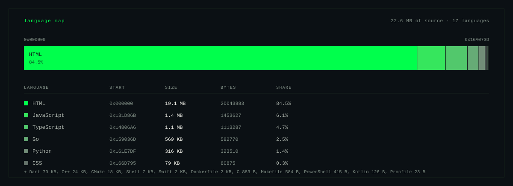

<!--fig-header-->
<picture>
  <source media="(prefers-color-scheme: dark)" srcset="assets/header-dark.svg">
  
</picture>
<!--/fig-header-->

## The habit

Most machine learning tutorials show you how to fit a model. Nobody shows you how
to ask whether the model is answering the right question.

A 97 % accuracy is not always a model that works. Sometimes it is a model that
learned the majority class and is quietly ignoring everything interesting. The loss
curve goes down, the benchmark number goes up, and nobody looks at the confusion
matrix until it is in production. So I look at it first. Before I fit anything I
want to know what the metric is actually measuring, which cases it skips, and what
the ground truth would have to be for the number to mean what I think it means.

The result takes longer to set up and is harder to game. It is why `ModelAudit`
probes what a model *does* rather than what it *says*, and why the F1 telemetry
platform queries at the database layer instead of pulling a full race into memory.

I'm Kayra, from Türkiye. I write Python, TypeScript and Go, and I pick whichever
one the problem is asking for: anything with data gets Python, a bot or API gets
TypeScript, a CLI tool gets Go.

<!--fig-fields-->
<picture>
  <source media="(prefers-color-scheme: dark)" srcset="assets/fields-dark.svg">
  
</picture>
<!--/fig-fields-->

<!--fig-calendar-->
<picture>
  <source media="(prefers-color-scheme: dark)" srcset="assets/calendar-dark.svg">
  
</picture>
<!--/fig-calendar-->

## Things I've built

<!--projects-->
<table>
<tr>
<td width="50%" valign="top">

#### [ZscriptBot](https://github.com/Kayra-ML/ZscriptBot)
`TypeScript` — 6 stars

A modular Discord command bot. Every command lives in its own
file so the project does not collapse into one giant handler
as it grows. TypeScript keeps the message types honest.

**The interesting part:** the part everyone skips. Keeping a
bot codebase readable six months later means the architecture
has to enforce structure, not rely on the author remembering
where things go. That is what the file layout does here.

0x00 · 26 Aug 2026 → 17 Sep 2026

</td>
<td width="50%" valign="top">

#### [ModelAudit](https://github.com/Kayra-ML/ModelAudit)
`Python` · LLM Forensics · Prompt Evaluation

An open-source framework for **LLM identity forensics**, persona
detection and AI transparency verification.

**The interesting part:** models will tell you whatever you want
to hear if you ask them directly. The work is designing probes
that catch the gap between what a model claims and what it
actually does under pressure. Self-report is not evidence.

0x01 · 2026

</td>
</tr>
<tr>
<td width="50%" valign="top">

#### [SearchForge\_open](https://github.com/Kayra-ML/SearchForge_open)
`JavaScript` — 4 stars

Open-source search tooling. The closed core lives elsewhere;
this is the part that can be shared.

**The interesting part:** search that does not require a running
backend. The index is built once, shipped as a static file,
and queried entirely in the browser. No server, no latency on
every keystroke.

0x02 · 27 Aug 2026 → 17 Sep 2026

</td>
<td width="50%" valign="top">

#### [RoveCode\_plugins](https://github.com/Kayra-ML/RoveCode_plugins)
`TypeScript` · MCP Server

A token-efficient, domain-aware MCP server with a deterministic
router across **11 plugins and 72 skills**.

**The interesting part:** the router. It has to dispatch to
exactly the right plugin without reading the full skill list on
every call, which is what naive implementations do. This one
reads once and routes in O(1).

0x03 · 2026

</td>
</tr>
<tr>
<td width="50%" valign="top">

#### [fast\_f1\_data](https://github.com/Kayra-ML/fast_f1_data)
`Python` · `FastAPI` · `PostgreSQL` · `React`

Formula 1 analytics platform processing telemetry, lap times
and race strategies with **RAM-efficient SQL queries**.

**The interesting part:** the naive approach pulls a full race
worth of telemetry into Python and runs out of memory before
the race is over. This one aggregates at the database layer
and only materialises the rows that are actually needed.

0x04 · 2026

</td>
<td width="50%" valign="top">

#### [zcore](https://github.com/Kayra-ML/zcore)
`HTML` · `CSS` · `JavaScript` — 5 stars

A frontend project written in plain HTML, CSS and JavaScript.
No framework. No build step.

**The interesting part:** most of the time a framework is chosen
before the problem is understood. Starting without one forces
you to understand what you actually need before you reach for
a dependency that answers a question you have not asked yet.

0x05 · 05 Jul 2026 → 17 Sep 2026

</td>
</tr>
<tr>
<td width="50%" valign="top">

#### [thomas](https://github.com/Kayra-ML/thomas)
`JavaScript` — 6 stars

A JavaScript project. Six stars on a repository with no
description is what happens when people find the code useful
before the author writes the README.

The README will exist eventually. The code already works.

0x06 · 26 Jun 2026 → 17 Sep 2026

</td>
<td width="50%" valign="top">

#### [KeyLingo](https://github.com/Kayra-ML/KeyLingo)
`Python` — 2 stars

A Python language utility. Solves a small, real problem that
kept coming up often enough to justify writing a tool for it.

Small tools that do one thing right are worth more than large
tools that do many things approximately.

0x07 · 15 Sep 2026 → 17 Sep 2026

</td>
</tr>
<tr>
<td width="50%" valign="top">

#### [Rove\_cli](https://github.com/Kayra-ML/Rove_cli)
`Go` · MIT

A CLI tool — written while learning Go. First Go project; it
is here because the work is real, not because the project is
finished. The day a more serious Go repository exists, this
line updates.

0x08 · 17 Sep 2026

</td>
<td width="50%" valign="top">

#### [pyutils-toolkit](https://github.com/Kayra-ML/pyutils-toolkit)
`Python`

Utilities that kept coming up in different Python projects,
collected into one place instead of copied across repositories.
Not a product. A toolbox.

0x09 · 17 Sep 2026

</td>
</tr>
</table>
<!--/projects-->

<!--fig-segments-->
<picture>
  <source media="(prefers-color-scheme: dark)" srcset="assets/segments-dark.svg">
  
</picture>
<!--/fig-segments-->

<!--fig-langs-->
<picture>
  <source media="(prefers-color-scheme: dark)" srcset="assets/langs-dark.svg">
  
</picture>
<!--/fig-langs-->

## What this page is not telling you

Every profile shows its wins. Here is the other column, because a page without one
is a sales pitch.

- **The account is young.** It opened in July 2026. The calendar above is mostly
  empty for a reason, and the figure marks exactly where it stops being empty
  rather than cropping the year to look busier.
- **Stars are not users.** A few of my repositories have stars. That mostly means
  the README was readable, not that anyone ran the thing in a real environment.
  I have not done the work of getting any of this in front of someone who would.
- **ML is genuinely in progress.** I describe myself as working in ML; the bytes
  above describe someone who knows Scikit-Learn well and is still on the way to
  PyTorch. Both things are true.
- **The language split is lopsided.** Python is most of my source. I describe
  myself as writing three languages; the memory map describes someone who reaches
  for Python first and the others occasionally.
- **Some repositories are not finished.** `pyutils-toolkit` is a toolbox.
  `Rove_cli` came out of learning Go. They are on the profile because they are
  real, not because they are done.

## Now

- Going deeper into the ML fundamentals: not just fitting models but understanding
  why a given metric means what it means and what a model is actually learning.
- **PyTorch** and Deep Learning are next on the list. Nothing public in it yet —
  it goes on this page the day there is a repository to point at.
- The project list above is not a final state. More coming.

## How this page is built

The figures above are hand-drawn SVGs stored in `assets/` and referenced from the
README via `<picture>` tags so a reader on GitHub's light theme gets the same image
rather than a black slab. Each figure is written once for dark and mirrored for
light.

The struct fields in the activity figure above are the real numbers — repository
count, the actual opened date, the languages in order of use. The calendar is a
hexdump where each cell is one day of 2026 and the shade of green is the commit
count, so it reads as a heat map from a distance and as data up close. The wordmark
in the header is drawn as SVG paths rather than set in a font, because no webfont
survives GitHub's SVG sanitiser.

<b>Türkçe</b>

 

Merhaba, ben **Kayra**. **Türkiye**'de yaşıyorum. **Python, TypeScript ve Go**
yazıyorum ve problem hangisini istiyorsa onu kullanıyorum.

Yaptığım işlerin çoğunda ortak bir alışkanlık var: **modele veri vermeden önce
soruya bakıyorum.** 97% doğruluk bazen gerçekten çalışan bir model demek değildir.
Bazen çoğunluk sınıfını öğrenmiş ve ilginç her şeyi sessizce görmezden gelen bir
model demektir. Loss eğrisi aşağı gider, benchmark sayısı yükselir ve kimse
confusion matrix'e production'a gidene kadar bakmaz.

Ben önce bakıyorum. `ModelAudit` bunun yüzünden var: bir modelin ne *dediğine*
değil, ne *yaptığına* bakıyor. F1 telemetri platformu da bunun yüzünden var: naif
yaklaşım tüm yarış verisini belleğe çekip bitiyor; bu öyle yapmıyor.

Yukarıdaki "What this page is not telling you" bölümü de aynı sebepten var: hesap
genç, yıldızlar az, dil dağılımı Python'a ciddi şekilde kayık ve ML hâlâ aktif
olarak öğreniliyor. Bunları saklamak yerine yazmak daha doğru geliyor.

## Reach me

**byildiz.codes@gmail.com** · [@Kayra-ML](https://github.com/Kayra-ML) · [kayra-ml.github.io](https://kayra-ml.github.io)

Open to interesting problems, especially anything involving data that has not been
looked at carefully yet.
