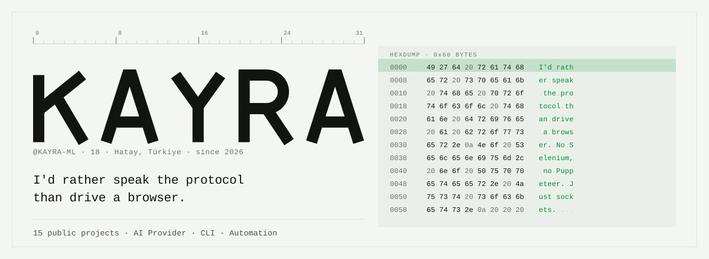
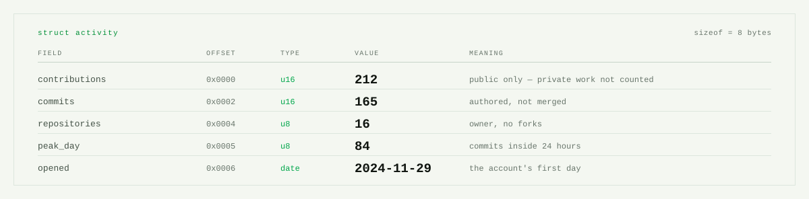
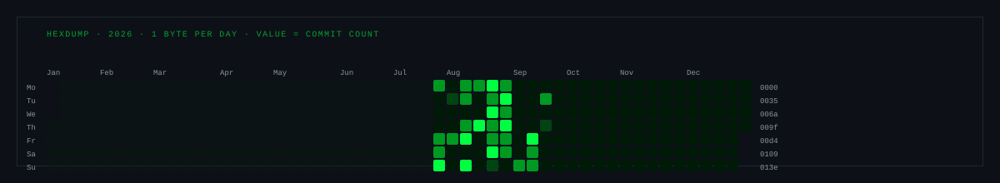
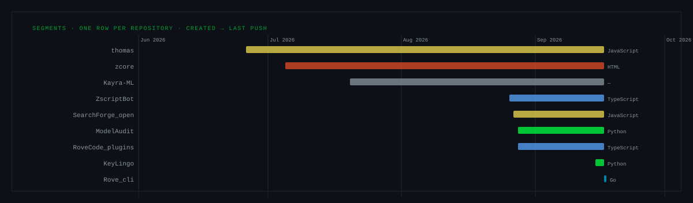
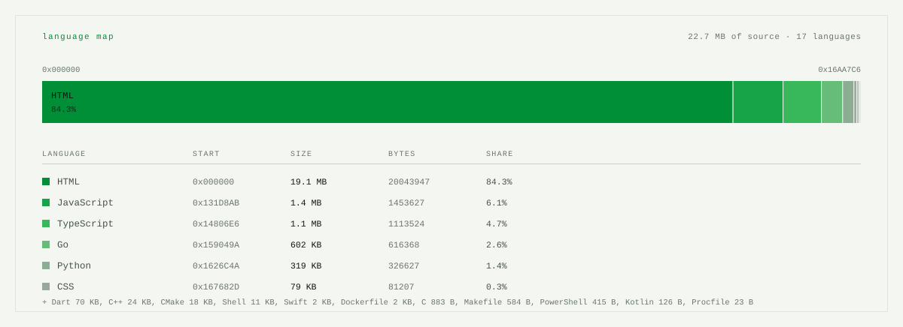

<!--fig-header-->

<picture>
  <source media="(prefers-color-scheme: dark)" srcset="assets/header-dark.svg">
  
</picture>
<!--/fig-header-->

The habit

Headless Chrome is roughly 300 MB of dependency to press a button that is really
one HTTP request. So I read the traffic instead, work out what the server
actually wants, and send that.

The result is smaller, it is faster, and it does not break when somebody renames
a CSS class. It is why aterkeep fits in a 2.3 MB binary with no runtime under
it, and why shortlink-bypass resolves a gateway in milliseconds where a browser
needs seconds.

I'm Kayra, 18, from Hatay. I write Rust, Node.js and Python, and I pick whichever
one the problem is asking for: a background daemon gets Rust, an edge API gets
JavaScript, anything with data in it gets Python.

<!--fig-fields-->

<picture>
  <source media="(prefers-color-scheme: dark)" srcset="assets/fields-dark.svg">
  
</picture>
<!--/fig-fields-->

<!--fig-calendar-->

<picture>
  <source media="(prefers-color-scheme: dark)" srcset="assets/calendar-dark.svg">
  
</picture>
<!--/fig-calendar-->

Things I've built

<!--projects-->

<table>
<tr>
<td width="50%" valign="top">

aterkeep

Rust · axum · tokio — 45 stars

A self-hosted manager that keeps a free Aternos Minecraft
server online around the clock. One ~2.3 MB binary: keep-alive
loop, embedded web panel in 14 languages, live console,
anti-idle Minecraft bot, AES-256-GCM encrypted session.

Hardest part: the queue. Aternos opens a ~30 second window
when your turn comes and sends you to the back if nobody
answers, which is why plain keep-alive scripts wait forever.
This one answers it.

Pure HTTP. No Selenium, no Puppeteer, no browser.

0x00 · 09 Aug 2026 → 27 Aug 2026

</td>
<td width="50%" valign="top">

shortlink-bypass

Python · curl — 2 stars — MIT

Resolves link-gateway services — linkvertise, adf.ly, cpmlink,
boost.ink, aylink — straight to the destination.
1240+ validated redirect followers.

Each gateway is a reverse-engineered redirect chain rather than
a rendered page, so it finishes in milliseconds where a headless
browser needs seconds.

Packaged with pyproject.toml, a one-line install.sh and CI.
Dead services get retired to shorteners_inactive.txt instead
of failing silently.

0x01 · 30 Jun 2026 → 19 Aug 2026

</td>
</tr>
<tr>
<td width="50%" valign="top">

cloudflare-temp-sms

Node.js · Fastify · Redis — MIT

Turns Cloudflare Email Routing into a zero-config disposable
temp-mail API. Create an inbox, receive mail by webhook,
everything expires on a Redis TTL.

Rate limiting and CORS are built in rather than bolted on, and
it ships with Docker, Railway and Render configs, so deploying
it is one command wherever you like.

0x02 · 20 Jul 2026 → 19 Aug 2026

</td>
<td width="50%" valign="top">

comic-translator

Python · OpenCV · EasyOCR · Streamlit

A full comic and manga translation pipeline: speech-bubble
detection, OCR, translation, then re-rendering the new text
back into the original bubble, with a Streamlit UI on top.

The interesting problem is not the translating. It is putting
the text back so the page still looks drawn rather than
pasted.

0x03 · 30 Jun 2026 → 19 Aug 2026

</td>
</tr>
<tr>
<td width="50%" valign="top">

valorant-fandom

HTML · Python · JavaScript

Valorant wiki data as a serverless JS library — agents,
weapons, maps, ranks and skins across 5 modules, served straight
from GitHub raw URLs.

Scraped once with Python, shipped as static JSON. No API key, no
backend, no rate limit.

0x04 · 10 Jul 2026 → 19 Aug 2026

</td>
<td width="50%" valign="top">

agent-setup

docs

Cross-OS setup memory for coding agents — OpenCode, Claude Code
and Codex — so a Windows, Linux and macOS machine can each log
what they configured and stay in sync.

Notes rather than a program, but it saves an afternoon every
time a new box gets set up.

0x05 · 19 Jul 2026 → 19 Aug 2026

</td>
</tr>
<tr>
<td width="50%" valign="top">

netportal

HTML

Sıradan bir kayıt formu. Telefon numaranızı girmeyi deneyin.

0x06 · 07 Sep 2026 → 07 Sep 2026

</td>
<td width="50%" valign="top">

astor-web

TypeScript

Astor Enerji kurumsal web sitesi — Next 16 statik export, GitHub Pages

0x07 · 03 Sep 2026 → 03 Sep 2026

</td>
</tr>
<tr>
<td width="50%" valign="top">

claude-desktop-glm

PowerShell

Point the Claude Desktop app at GLM 5.3 or any Anthropic-compatible gateway, from PowerShell

0x08 · 01 Sep 2026 → 01 Sep 2026

</td>
<td width="50%" valign="top">

nimbus-cloud-gaming

HTML

NIMBUS — cloud gaming concept site for KodYazar Codejam 2026

0x09 · 30 Aug 2026 → 30 Aug 2026

</td>
</tr>
<tr>
<td width="50%" valign="top">

yanmasa

Python · agentic-ai · ai-agent · ai-assistant — 3 stars — MIT

A Windows 11 computer-control agent that gets its own desktop and its own cursor — so it works while you keep using yours. Claude computer-use + PySide6.

0x0A · 27 Aug 2026 → 30 Aug 2026

</td>
<td width="50%" valign="top">

kablo

Kotlin

Run Claude Code on your desktop from your phone. QR pairing, free Cloudflare tunnel, no server.

0x0B · 22 Aug 2026 → 22 Aug 2026

</td>
</tr>
<tr>
<td width="50%" valign="top">

curfew

Rust · automation · claude · claude-code — MIT

Run Claude Code until a wall-clock deadline, then stop.

0x0C · 20 Aug 2026 → 20 Aug 2026

</td>
<td width="50%" valign="top">

reread

Rust · claude · claude-code · cli — MIT

Where Claude Code tokens actually go: 96% of them are re-reads.

0x0D · 20 Aug 2026 → 20 Aug 2026

</td>
</tr>
<tr>
<td width="50%" valign="top">

auto-ominous

Java · fabric · fabricmc · minecraft — 1 star — MIT

One key drinks an Ominous Bottle from anywhere in your inventory and puts your hotbar back. Fabric, Minecraft 1.21.1 to 1.21.11.

0x0E · 11 Aug 2026 → 19 Aug 2026

</td>
<td width="50%"></td>
</tr>
</table>
<!--/projects-->

<!--fig-segments-->

<picture>
  <source media="(prefers-color-scheme: dark)" srcset="assets/segments-dark.svg">
  
</picture>
<!--/fig-segments-->

<!--fig-langs-->

<picture>
  <source media="(prefers-color-scheme: dark)" srcset="assets/langs-dark.svg">
  
</picture>
<!--/fig-langs-->

What this page is not telling you

Every profile shows its wins. Here is the other column, because a page without one
is a sales pitch.

The account is young. It opened in June 2026. The contribution wall above is
mostly empty for a reason, and the figure marks exactly where it stops being
empty rather than cropping the year to look busier.

Stars are not users. Nearly all of mine are on one repository. Across every
project there is a single fork and not one issue, which is what it looks like
when people like the README and never run the thing. I have not done the work
of getting any of this in front of someone who would.

The language split is lopsided. Look at the map above: Python is most of my
public source and Rust is most of the rest. I describe myself as writing three
languages; the bytes describe someone who reaches for Python first.

Test coverage is thin. shortlink-bypass has CI and a validated gateway
list. Most of the rest is verified by running it, which is not the same thing.

Some repositories are dumps, not products. agent-setup is notes.
valorant-fandom is scraped JSON. They are on the profile because they are
real, not because they are finished.

Now

Turning aterkeep into something a stranger can install: 14 languages,
installers for three platforms, a design system, a promo video per language.

Reading a lot of Go. Nothing public in it yet, so it is not in the list
above — it goes there the day there is a repository to point at.

Whatever catches my attention next. I'm 18 and I would rather stay curious than
specialise early.

How this page is built

Every figure above is drawn by scripts/build.py from the
GitHub GraphQL API, on a schedule and on every push
in Actions. No badge service, nothing hand-typed,
no number that can quietly go stale.

The figures are not decoration with data poured in. The language map's addresses
are the real byte counts GitHub reports per language. The calendar is a hexdump
where each byte is that day's commit count, so it reads as a heat map from a
distance and as data up close. The wordmark is drawn as paths rather than set in a
font, because no webfont survives GitHub's SVG sanitiser and the closest installed
face would have been a worse answer than drawing six letters.

Each figure is written twice, once per theme, and paired in a <picture>, so a
reader on GitHub's light theme is not handed a black slab.

<b>Türkçe</b>

 

Merhaba, ben Kayra. 18 yaşındayım, Hatay'da yaşıyorum. Rust, Node.js ve
Python yazıyorum ve problem hangisini istiyorsa onu kullanıyorum.

Yaptığım işlerin çoğunda ortak bir alışkanlık var: tarayıcı sürmektense
protokolü kendim konuşmayı tercih ediyorum. Aslında tek bir HTTP isteğinden
ibaret olan bir düğmeye basmak için 300 MB'lık headless Chrome taşımanın anlamı
yok. Trafiği okuyup sunucunun gerçekte ne istediğini çıkarıyorum ve onu
gönderiyorum. Sonuç daha küçük, daha hızlı oluyor ve biri bir CSS sınıfının adını
değiştirdiğinde bozulmuyor.

aterkeep'in hiçbir runtime'a ihtiyaç duymadan 2.3 MB'lık tek bir binary'ye
sığmasının sebebi bu.

Yukarıdaki "What this page is not telling you" bölümü de aynı sebepten var: hesap
yeni, yıldızlar tek haneli ve dil dağılımı Python'a fena hâlde kayık. Bunları
saklamak yerine ölçüp yazmak bana daha doğru geliyor.

Reach me

@KAYRA-ML

Open to interesting problems, especially anything involving a protocol nobody
documented.
